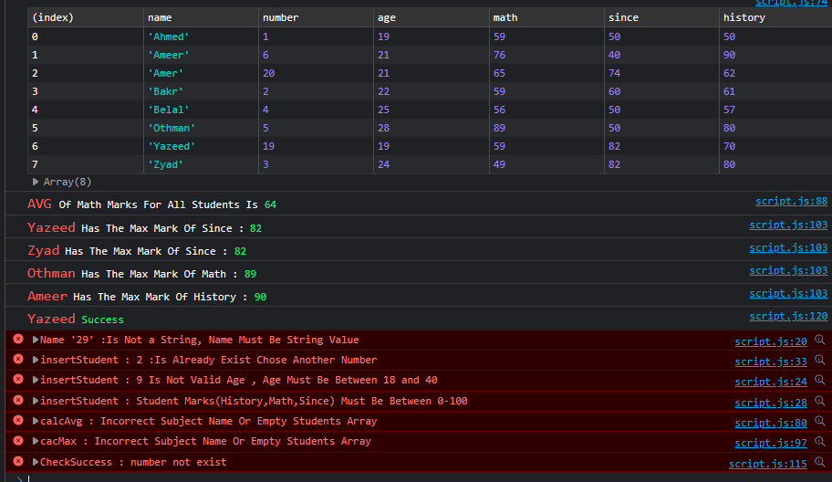

# functional-table 🔰
Simple HTML/CSS /JS single page app contain basics of JavaScript data manipulation, it provides some functions that will be useful with tables: display items, delete item and adding. 

### About This Project : 

1 . i have an array of student objects ,each of them has 
  - Nme 
  - Age
  - Number
  - Math
  - Since
  - History 

2 . also we have four main fucntions :
   - insertStudent(...)
   - calcAvg()
   - calcMax('subject')
   - chechkSuccess(stud.num)

Untill **Now**( the upload commit)  i've done the basic table design (html&css) and js code, it will work on **console** and output like this : 

### Targets
- [x] Finish design 
- [ ] Connect the code with html design

